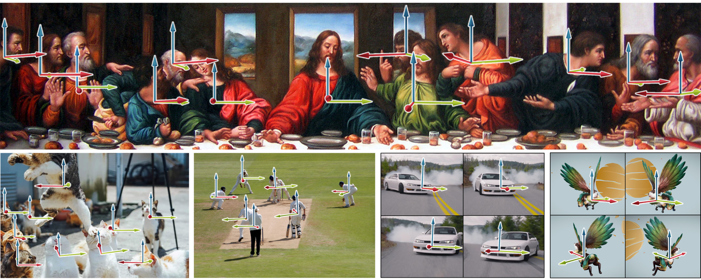

<div align="center">
<h2>Orient Anything: Learning Robust Object Orientation Estimation from Rendering 3D Models</h2>

[**Zehan Wang**](https://scholar.google.com/citations?user=euXK0lkAAAAJ&hl=zh-CN)<sup>1*</sup> · [**Ziang Zhang**](https://scholar.google.com/citations?hl=zh-CN&user=DptGMnYAAAAJ)<sup>1*</sup> · [**Tianyu Pang**](https://scholar.google.com/citations?hl=zh-CN&user=wYDbtFsAAAAJ)<sup>2</sup> · [**Du Chao**](https://scholar.google.com/citations?hl=zh-CN&user=QOp7xW0AAAAJ)<sup>2</sup> · [**Hengshuang Zhao**](https://scholar.google.com/citations?user=4uE10I0AAAAJ&hl&oi=ao)<sup>3</sup> · [**Zhou Zhao**](https://scholar.google.com/citations?user=IIoFY90AAAAJ&hl&oi=ao)<sup>1</sup>

<sup>1</sup>Zhejiang University&emsp;&emsp;&emsp;&emsp;<sup>2</sup>SEA AI Lab&emsp;&emsp;&emsp;&emsp;<sup>3</sup>HKU

*Equal Contribution


<a href=""></a>
<a href=''></a>
<a href='g'></a>
<a href=''></a>
</div>

**Orient Anything**, a robust image-based object orientation estimation model. By training on 2M rendered labeled images, it achieves strong zero-shot generalization ability for images in the wild.



## News

* **2024-12-24:** Paper, project page, code, models, and demo ([HuggingFace](https://huggingface.co/spaces/Viglong/Orient-Anything)) are released.


## Pre-trained models

We provide **three models** of varying scales for robust object orientation estimation in images:

| Model | Params | Checkpoint |
|:-|-:|:-:|
| Orient-Anything-Small | - M | Coming soon |
| Orient-Anything-Base | - M | Coming soon |
| Orient-Anything-Large | - M | [Download](https://huggingface.co/Viglong/OriNet/blob/main/croplargeEX2/dino_weight.pt) |

## Usage

### 1 Prepraration

```bash
pip install -r requirements.txt
```

### 2 Use our models
#### 2.1 In Gradio app
Start gradio by executing the following script:

```bash
python app.py
```
then open GUI page(default is https://127.0.0.1:7860) in web browser.

or, you can try it in our [Huggingface-Space](https://huggingface.co/spaces/Viglong/Orient-Anything)

#### 2.2 In Python Scripts
```python
from paths import *
import numpy as np
from vision_tower import DINOv2_MLP
from transformers import AutoImageProcessor
import torch
import os
from PIL import Image

import torch.nn.functional as F
from utils import *

from huggingface_hub import hf_hub_download
ckpt_path = hf_hub_download(repo_id="Viglong/OriNet", filename="croplargeEX2/dino_weight.pt", repo_type="model", cache_dir='./', resume_download=True)
print(ckpt_path)

save_path = './'
device = 'cuda' if torch.cuda.is_available() else 'cpu'
dino = DINOv2_MLP(
                    dino_mode   = 'large',
                    in_dim      = 1024,
                    out_dim     = 360+180+180+2,
                    evaluate    = True,
                    mask_dino   = False,
                    frozen_back = False
                )

dino.eval()
print('model create')
dino.load_state_dict(torch.load(ckpt_path, map_location='cpu'))
dino = dino.to(device)
print('weight loaded')
val_preprocess   = AutoImageProcessor.from_pretrained(DINO_LARGE, cache_dir='./')


def get_3angle(image):
    
    # image = Image.open(image_path).convert('RGB')
    image_inputs = val_preprocess(images = image)
    image_inputs['pixel_values'] = torch.from_numpy(np.array(image_inputs['pixel_values'])).to(device)
    with torch.no_grad():
        dino_pred = dino(image_inputs)

    gaus_ax_pred   = torch.argmax(dino_pred[:, 0:360], dim=-1)
    gaus_pl_pred   = torch.argmax(dino_pred[:, 360:360+180], dim=-1)
    gaus_ro_pred   = torch.argmax(dino_pred[:, 360+180:360+180+180], dim=-1)
    confidence     = F.softmax(dino_pred[:, -2:], dim=-1)[0][0]
    angles = torch.zeros(4)
    angles[0]  = gaus_ax_pred
    angles[1]  = gaus_pl_pred - 90
    angles[2]  = gaus_ro_pred - 90
    angles[3]  = confidence
    return angles

image_path = '/path/to/image'
origin_image = Image.open(image_path).convert('RGB')
angles = get_3angle(origin_image)
azimuth     = float(angles[0])
polar       = float(angles[1])
rotation    = float(angles[2])
confidence  = float(angles[3])


```


### Best Practice
To avoid ambiguity, our model only supports inputs that contain images of a single object. For daily images that usually contain multiple objects, it is a good choice to isolate each object with DINO-grounding and predict the orientation separately.

To construct the pipeline, please refer to [Grounded-Segment-Anything](https://github.com/IDEA-Research/Grounded-Segment-Anything).

### Test-Time Augmentation
In order to further enhance the robustness of the model，We further propose the test-time ensemble strategy. The input images will be randomly cropped into different variants, and the predicted orientation of different variants will be voted as the final prediction result. We implement this strategy in functions `get_3angle_infer_aug()` and `get_crop_images()`.


## Citation

If you find this project useful, please consider citing:

```bibtex
@article{orient_anything,
  title={Orient Anything: Learning Robust Object Orientation Estimation from Rendering 3D Models},
  author={Wang, Zehan and Zhang, Ziang and Pang, Tianyu and Du, Chao and Zhao, Hengshuang and Zhao, Zhou},
  journal={arXiv:2412.xxxxx},
  year={2024}
}
```

## Acknowledgement
Thanks to the open source of the following projects: [Grounded-Segment-Anything](https://github.com/IDEA-Research/Grounded-Segment-Anything), [render-py](https://github.com/tvytlx/render-py)
